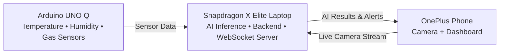

<div align="center">

# 🚨 OmniSight-XR

### Offline AI-Powered Disaster Response System

**Built for the Snapdragon Multiverse Hackathon 2026**

*Helping first responders detect victims and hazards in real time — even without internet connectivity.*

<p>
  
  
  
  
  
</p>

---

**📍 Offline • 🤖 Edge AI • 📱 Multi-Device • 🌐 Local Network • 🚑 Disaster Response**

</div>

---


## 🌍 Overview

**OmniSight-XR** is an **offline AI-powered disaster response system** designed to assist first responders during emergencies such as earthquakes, building collapses, fires, and industrial accidents.

The system combines **environmental sensors**, **edge AI**, and **real-time communication** to help rescue teams quickly identify hazardous conditions and locate trapped victims without relying on internet connectivity.

It uses an **Arduino UNO Q** to monitor temperature, humidity, and gas levels, a **Snapdragon X Elite laptop** to perform on-device AI inference and coordinate the system, and a **OnePlus smartphone** to stream live video and display rescue information. All devices communicate over a **local Wi-Fi network**, ensuring reliable operation even when cellular and internet services are unavailable.

OmniSight-XR is built with a **modular, scalable architecture**, allowing the sensing unit to be carried by a rescue worker or integrated into future platforms such as drones or autonomous rescue robots.

## ❗ Problem

During disasters such as earthquakes, building collapses, fires, and industrial accidents, rescue teams often face limited visibility, hazardous environments, and disrupted communication networks.

Without reliable information, responders may unknowingly enter dangerous areas with toxic gas, extreme temperatures, or unstable conditions, putting both victims and rescuers at risk.

Most existing solutions rely on expensive equipment or cloud connectivity, making them difficult to deploy when internet access is unavailable.

There is a need for an affordable, portable, and **offline-first** system that can detect hazards, identify victims, and provide real-time situational awareness to rescue teams.

## 💡 Solution

OmniSight-XR provides an **offline, AI-powered disaster response platform** that connects multiple devices into a single rescue ecosystem.

- **Arduino UNO Q** continuously monitors **temperature, humidity, and hazardous gas levels**.
- **OnePlus smartphone** captures and streams live video of the disaster site.
- **Snapdragon X Elite laptop** performs **on-device AI person detection**, combines camera and sensor data, and evaluates the overall risk.
- The processed information is sent to a **live mobile dashboard** over a **local Wi-Fi network**, allowing rescue teams to monitor the situation in real time.

Since all communication and AI processing happen **locally**, OmniSight-XR continues to operate even when internet or cellular networks are unavailable, making it reliable for disaster response scenarios.

## ✨ Features

- 🤖 **On-Device AI Detection** – Detects trapped victims using AI accelerated by the Snapdragon X Elite NPU.
- 🌡️ **Environmental Monitoring** – Continuously monitors temperature, humidity, and hazardous gas levels.
- 📡 **Offline Communication** – Operates entirely over a local Wi-Fi network with no internet dependency.
- 📱 **Live Rescue Dashboard** – Displays real-time sensor data, AI detections, and alerts on a mobile device.
- ⚠️ **Smart Hazard Alerts** – Notifies responders when dangerous environmental conditions are detected.
- 🔄 **Multi-Device Orchestration** – Seamlessly connects the Arduino, Snapdragon laptop, and smartphone into one coordinated system.
- ⚡ **Real-Time Processing** – Combines sensor readings and AI detections with low-latency updates.
- 🧩 **Modular & Scalable Design** – Easily extendable to support additional sensors, drones, or robotic rescue platforms.

## 🏗️ Architecture

OmniSight-XR follows a **multi-device edge computing architecture** where environmental sensors, AI processing, and the user interface run on separate devices while communicating over a **local Wi-Fi network**. This ensures reliable operation even when internet connectivity is unavailable.



### Device Responsibilities

| Device | Responsibility |
|---------|----------------|
| **Arduino UNO Q** | Collects temperature, humidity, and gas sensor data. |
| **Snapdragon X Elite Laptop** | Runs AI inference, processes sensor data, calculates risk, and manages communication. |
| **OnePlus Phone** | Streams live camera feed and displays the rescue dashboard with alerts. |

## 🔧 Hardware

OmniSight-XR is built using three devices that work together to provide real-time disaster monitoring and victim detection.

| Device | Purpose |
|---------|---------|
| **Arduino UNO Q** | Collects environmental data from temperature, humidity, and gas sensors. |
| **Temperature & Humidity Sensor** | Monitors environmental conditions around the disaster site. |
| **Gas Sensor** | Detects hazardous gases and alerts responders to unsafe conditions. |
| **OnePlus Smartphone** | Streams live camera footage and displays the rescue dashboard. |
| **Snapdragon X Elite Laptop** | Acts as the central hub, running AI inference, processing sensor data, and managing communication between devices. |

> **Central Device:** The Snapdragon X Elite laptop is the brain of the system. It receives sensor data from the Arduino, processes the live camera feed using on-device AI, combines both data sources, and sends real-time alerts to the mobile dashboard over a local Wi-Fi network.

## 💻 Tech Stack

| Category | Technology |
|----------|------------|
| **Programming Languages** | Python, C/C++, JavaScript |
| **Frontend** | React, Vite, HTML5, CSS3 |
| **Backend** | Python, `asyncio`, WebSockets |
| **Computer Vision** | OpenCV |
| **AI / ML** | Qualcomm AI Hub, Snapdragon NPU, Pre-trained Object Detection Model |
| **Embedded System** | Arduino UNO Q |
| **Sensors** | Temperature & Humidity Sensor, Gas Sensor |
| **Communication** | Local Wi-Fi, JSON, WebSockets |
| **Development Tools** | Arduino IDE, VS Code, Git, GitHub |
| **Target Platform** | Snapdragon X Elite Laptop, OnePlus Smartphone |

## 📂 Project Structure

```text
OmniSight-XR/
│
├── arduino/                 # Arduino firmware and sensor code
│   ├── firmware/
│   └── README.md
│
├── backend/                 # Python backend
│   ├── ai/                  # AI inference modules
│   ├── api/                 # API & WebSocket handlers
│   ├── utils/               # Helper functions
│   ├── models/              # AI models
│   └── server.py            # Main backend server
│
├── frontend/                # React dashboard
│   ├── public/
│   ├── src/
│   │   ├── components/
│   │   ├── pages/
│   │   ├── hooks/
│   │   └── services/
│   └── package.json
│
├── assets/                  # Images, icons, screenshots
│
├── docs/                    # Project documentation
│
├── README.md
├── requirements.txt
├── LICENSE
└── .gitignore
```

## 🚀 Quick Start

## 🔄 Workflow

## 📱 Dashboard

## 📸 Demo

## 👨‍💻 Team

## 🚀 Future Scope

## 📜 License
