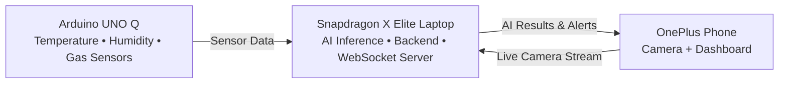

<div align="center">

# 🚨 OmniSite

### AI-Powered Offline Disaster Monitoring & Victim Detection System

**Built for the Snapdragon Multiverse Hackathon 2026**

*Real-time environmental monitoring, AI-based human detection, and offline emergency response using Edge AI.*

<p>
  
  
  
  
  
  
</p>

---

**📡 Offline First • 🤖 Edge AI • 📹 Live Detection • 📍 Location Mapping • 🚑 Disaster Response**

</div>

---


## 🌍 Overview

**SensorNode** is an **offline AI-powered disaster monitoring and victim detection system** designed to assist rescue teams in hazardous environments where internet connectivity may be unavailable.

The system combines **real-time environmental sensing**, **AI-based human detection**, **live video streaming**, and **location mapping** into a unified dashboard that provides situational awareness during emergency response operations.

The backend is built using **Flask** with **SQLite** for lightweight data storage, while a **React dashboard** visualizes live sensor readings, risk levels, AI detections, historical trends, and detected victim locations.

A **YOLO11 object detection model** running on a webcam identifies people in real time and streams annotated video to the dashboard. Every confirmed detection is stored as a geographic point using a configurable **Mock GPS**, allowing the complete system to be demonstrated without requiring physical GPS hardware.

For demonstrations without embedded hardware, a built-in **sensor simulator** continuously generates realistic temperature, humidity, gas, distance, and obstacle readings. The simulator enables the dashboard, backend, and AI pipeline to function exactly as they would with real sensors.

The project follows a **modular architecture**, allowing the simulator to be seamlessly replaced with real Arduino sensors, GPS modules, and LoRa communication without modifying the backend or frontend. This makes SensorNode suitable for both software demonstrations and real-world disaster response deployments.

## ❗ Problem

During disaster response operations such as earthquakes, building collapses, fires, and industrial accidents, first responders often have limited visibility into hazardous environments. Entering these areas without accurate information can expose rescue teams to dangerous conditions such as toxic gases, high temperatures, structural obstacles, and poor visibility.

Traditional monitoring systems frequently depend on cloud services, continuous internet connectivity, or expensive specialized equipment. However, communication networks are often disrupted during emergencies, making these solutions unreliable when they are needed most.

Additionally, rescue teams require a unified view of environmental conditions, live visual information, and victim locations. Existing systems typically provide only isolated sensor readings or camera feeds, forcing responders to manually combine information from multiple sources and slowing critical decision-making.

There is a need for an affordable, offline-first, and real-time disaster monitoring system that can:

- Detect people using AI-powered computer vision.
- Monitor environmental conditions such as temperature, humidity, gas levels, and nearby obstacles.
- Stream live annotated video to responders.
- Mark potential victim locations on a map.
- Assess risk levels instantly.
- Continue operating even when internet connectivity is unavailable.

SensorNode addresses these challenges by combining edge AI, real-time sensor monitoring, live video streaming, and location mapping into a single integrated platform designed for disaster response.

## 💡 Solution

SensorNode provides an **offline-first, AI-powered disaster monitoring platform** that integrates computer vision, environmental sensing, and real-time visualization into a single system for emergency response.

The system consists of four core components working together over a local network:

- **AI Camera Module** captures live webcam footage and performs **real-time person detection** using the **YOLO11** object detection model. Detected individuals are highlighted with bounding boxes, and their locations are recorded using a configurable **Mock GPS** for demonstration purposes.
- **Flask Backend** acts as the central hub, receiving live video frames, sensor readings, AI detection results, and location points. It stores historical data in **SQLite**, computes the overall risk level, and exposes REST APIs for the dashboard.
- **Sensor Simulator** continuously generates realistic temperature, humidity, gas, distance, and obstacle readings, enabling the complete system to operate without requiring physical hardware. The simulator can later be replaced by a real Arduino-based sensing unit without changing the backend or frontend.
- **React Dashboard** provides a real-time monitoring interface displaying the live camera feed, environmental sensor values, AI detection status, risk alerts, historical charts, and a map of detected life locations.

All communication occurs over a **local network**, allowing the platform to function without internet connectivity. Thanks to its modular architecture, SensorNode can seamlessly transition from a software-only demonstration to a real deployment by replacing the simulator with Arduino sensors, integrating GPS modules, and enabling long-range LoRa communication.

## ✨ Features

- 🤖 **Real-Time AI Person Detection** – Detects people using the YOLO11 object detection model and displays live bounding boxes with confidence scores.
- 📹 **Live Video Streaming** – Streams annotated webcam footage to the dashboard using an MJPEG video feed for real-time monitoring.
- 🌡️ **Environmental Monitoring** – Continuously monitors temperature, humidity, gas concentration, distance, and obstacle status.
- ⚠️ **Intelligent Risk Assessment** – Automatically classifies the environment as **SAFE**, **WARNING**, or **CRITICAL** based on configurable sensor thresholds and AI detection results.
- 📍 **Life Detection Mapping** – Records detected person locations as map markers using GPS coordinates (Mock GPS for demo, real GPS supported).
- 📊 **Interactive Dashboard** – Displays live sensor readings, AI detections, risk status, historical charts, and location data in a unified React interface.
- 🗄️ **Historical Data Storage** – Stores sensor readings and detection history in SQLite for visualization and analysis.
- 🔄 **REST API Architecture** – Provides well-defined API endpoints for sensor data, AI detections, video streaming, historical records, and map points.
- 📡 **Offline-First Operation** – Runs entirely over a local network without requiring cloud services or internet connectivity.
- 🧪 **Built-In Sensor Simulator** – Generates realistic environmental data, enabling full system demonstrations without Arduino hardware.
- 🔌 **Hardware Ready** – Supports seamless replacement of the simulator with real Arduino sensors, GPS modules, and LoRa communication without modifying the backend or frontend.
- 🧩 **Modular & Scalable Design** – Independent backend, frontend, AI, and sensing modules simplify development, testing, and future expansion.

## 🏗️ Architecture

OmniSight-XR follows a **multi-device edge computing architecture** where environmental sensors, AI processing, and the user interface run on separate devices while communicating over a **local Wi-Fi network**. This ensures reliable operation even when internet connectivity is unavailable.



### Device Responsibilities

| Device | Responsibility |
|---------|----------------|
| **Arduino UNO Q** | Collects temperature, humidity, and gas sensor data. |
| **Snapdragon X Elite Laptop** | Runs AI inference, processes sensor data, calculates risk, and manages communication. |
| **OnePlus Phone** | Streams live camera feed and displays the rescue dashboard with alerts. |

## 🔧 Hardware

OmniSight-XR is built using three devices that work together to provide real-time disaster monitoring and victim detection.

| Device | Purpose |
|---------|---------|
| **Arduino UNO Q** | Collects environmental data from temperature, humidity, and gas sensors. |
| **Temperature & Humidity Sensor** | Monitors environmental conditions around the disaster site. |
| **Gas Sensor** | Detects hazardous gases and alerts responders to unsafe conditions. |
| **OnePlus Smartphone** | Streams live camera footage and displays the rescue dashboard. |
| **Snapdragon X Elite Laptop** | Acts as the central hub, running AI inference, processing sensor data, and managing communication between devices. |

> **Central Device:** The Snapdragon X Elite laptop is the brain of the system. It receives sensor data from the Arduino, processes the live camera feed using on-device AI, combines both data sources, and sends real-time alerts to the mobile dashboard over a local Wi-Fi network.

## 💻 Tech Stack

| Category | Technology |
|----------|------------|
| **Programming Languages** | Python, C/C++, JavaScript |
| **Frontend** | React, Vite, HTML5, CSS3 |
| **Backend** | Python, `asyncio`, WebSockets |
| **Computer Vision** | OpenCV |
| **AI / ML** | Qualcomm AI Hub, Snapdragon NPU, Pre-trained Object Detection Model |
| **Embedded System** | Arduino UNO Q |
| **Sensors** | Temperature & Humidity Sensor, Gas Sensor |
| **Communication** | Local Wi-Fi, JSON, WebSockets |
| **Development Tools** | Arduino IDE, VS Code, Git, GitHub |
| **Target Platform** | Snapdragon X Elite Laptop, OnePlus Smartphone |

## 📂 Project Structure

```text
OmniSight-XR/
│
├── arduino/                 # Arduino firmware and sensor code
│   ├── firmware/
│   └── README.md
│
├── backend/                 # Python backend
│   ├── ai/                  # AI inference modules
│   ├── api/                 # API & WebSocket handlers
│   ├── utils/               # Helper functions
│   ├── models/              # AI models
│   └── server.py            # Main backend server
│
├── frontend/                # React dashboard
│   ├── public/
│   ├── src/
│   │   ├── components/
│   │   ├── pages/
│   │   ├── hooks/
│   │   └── services/
│   └── package.json
│
├── assets/                  # Images, icons, screenshots
│
├── docs/                    # Project documentation
│
├── README.md
├── requirements.txt
├── LICENSE
└── .gitignore
```

## 🚀 Quick Start

### 1️⃣ Clone the Repository

```bash
git clone https://github.com/your-username/OmniSight-XR.git
cd OmniSight-XR
```

### 2️⃣ Install Dependencies

**Backend**

```bash
cd backend
pip install -r requirements.txt
```

**Frontend**

```bash
cd frontend
npm install
```

### 3️⃣ Upload Arduino Firmware

- Open the `arduino/` folder in **Arduino IDE**.
- Select your **Arduino UNO Q** board and COM port.
- Upload the firmware.

### 4️⃣ Start the Backend

```bash
cd backend
python server.py
```

### 5️⃣ Start the Frontend

```bash
cd frontend
npm run dev
```

### 6️⃣ Connect the Devices

- Connect the **Arduino UNO Q**, **Snapdragon X Elite Laptop**, and **OnePlus Phone** to the same local Wi-Fi network.
- Open the dashboard on your phone using the URL displayed by the frontend.

### 7️⃣ Start Monitoring

- Power on the Arduino.
- Start the phone camera stream.
- View live sensor data, AI detections, and hazard alerts on the dashboard.
## 🔄 Workflow

```text
┌──────────────────────┐
│   Arduino UNO Q      │
│ (Temp • Humidity •   │
│     Gas Sensors)     │
└──────────┬───────────┘
           │ Sensor Data
           ▼
┌──────────────────────┐
│ Snapdragon X Elite   │
│ • AI Person Detection│
│ • Risk Analysis      │
│ • Backend Server     │
└──────────┬───────────┘
           ▲
           │ Live Camera Stream
┌──────────┴───────────┐
│   OnePlus Phone      │
│      Camera          │
└──────────┬───────────┘
           │
           ▼
┌──────────────────────┐
│  Live Dashboard      │
│ • Victim Detection   │
│ • Sensor Readings    │
│ • Hazard Alerts      │
└──────────────────────┘
```

### How It Works

1. **Arduino UNO Q** continuously monitors **temperature, humidity, and gas levels**.
2. **OnePlus smartphone** captures a live video stream of the disaster area.
3. **Snapdragon X Elite laptop** receives both the sensor data and camera feed.
4. The laptop performs **AI-based person detection**, analyzes environmental conditions, and calculates the risk level.
5. The processed information is sent to the **mobile dashboard** in real time over a **local Wi-Fi network**, enabling rescue teams to make faster and safer decisions.

## 📱 Dashboard

The **OmniSight-XR Dashboard** provides rescue teams with a clear, real-time view of the disaster site by combining AI detections and environmental sensor data into a single interface.

### Dashboard Features

- 👤 **Victim Detection** – Displays AI-detected victims with confidence scores.
- 🌡️ **Temperature Monitoring** – Shows the current temperature.
- 💧 **Humidity Monitoring** – Displays environmental humidity levels.
- ☁️ **Gas Detection** – Indicates hazardous gas levels.
- ⚠️ **Hazard Alerts** – Highlights unsafe conditions using color-coded warnings.
- 📡 **Connection Status** – Shows the connectivity of all devices.
- 🕒 **Live Updates** – Refreshes automatically through WebSockets.

### Dashboard Preview

```text
+--------------------------------------------------+
|              🚨 OmniSight-XR Dashboard           |
+--------------------------------------------------+
| 👤 Victim Detected      ✅Yes(96% )             |
| 🌡️ Temperature          38° C                    |
| 💧 Humidity             72 %                     |
| ☁️ Gas Level            HIGH                     |
| ⚠️ Risk Level           🔴Critical              |
| 📡 Device Status        🟢Connected             |
+--------------------------------------------------+
|          Live Camera Feed / Detection            |
+--------------------------------------------------+
```

> The dashboard is optimized for mobile devices, enabling rescue teams to monitor hazards and victim detections in real time while operating entirely offline.

## 📸 Demo

### 🎥 Demo Video

> 📹 **Coming Soon** *(Demo video will be added after the final project implementation.)*

<!-- Replace with your demo video -->
<!-- https://youtu.be/your-demo-link -->

---

### 📷 Project Demo

#### 1️⃣ Hardware Setup
- Arduino UNO Q with Temperature, Humidity, and Gas Sensors
- Snapdragon X Elite Laptop (Central AI Hub)
- OnePlus Smartphone (Camera & Dashboard)

#### 2️⃣ Live AI Detection
- Person detected using on-device AI
- Real-time confidence score
- Live camera feed

#### 3️⃣ Environmental Monitoring
- Temperature monitoring
- Humidity monitoring
- Gas level detection
- Hazard alerts

#### 4️⃣ Mobile Dashboard
- Live sensor readings
- AI detection results
- Risk level indicators
- Device connection status

---

### 📸 Screenshots

| Hardware Setup | Dashboard |
|----------------|-----------|
| *Coming Soon* | *Coming Soon* |

| Live Detection | Architecture |
|----------------|--------------|
| *Coming Soon* | *Coming Soon* |

---

> **Demo Scenario:** A rescue worker approaches a disaster site with the OnePlus smartphone while the Arduino continuously monitors environmental conditions. The Snapdragon X Elite laptop processes the live camera feed using on-device AI, combines it with sensor data, and instantly displays victim detections, hazard alerts, and environmental readings on the dashboard—all without requiring an internet connection.

## 👨‍💻 Team

| Member | Role | Responsibilities |
|--------|------|------------------|
| **Member A** | 🔌 Embedded Systems | Arduino UNO Q, Temperature & Humidity Sensor, Gas Sensor Integration |
| **Member B** | 🤖 AI & Computer Vision | AI Model Integration, Person Detection, OpenCV Pipeline |
| **Member C** | ⚙️ Backend & Integration | Python Backend, WebSocket Server, Data Processing, Device Communication |
| **Member D** | 📱 Frontend & UI | React Dashboard, Mobile Interface, Real-Time Data Visualization |

---

### 🤝 Collaboration

Our team follows a modular development approach where each member owns a specific component while collaborating closely during system integration.

- 🔌 **Hardware Layer** – Sensor integration and Arduino firmware.
- 🤖 **AI Layer** – On-device person detection using Snapdragon AI.
- ⚙️ **Backend Layer** – Data processing, communication, and risk analysis.
- 📱 **Frontend Layer** – Dashboard design and real-time monitoring interface.

Together, these components create a seamless **offline, AI-powered disaster response system**.

## 🚀 Future Scope

Although OmniSight-XR is designed as an offline disaster response system, its modular architecture allows it to be extended for more advanced rescue operations in the future.

- 🚁 **Drone Integration** – Deploy drones for aerial surveillance and victim detection in inaccessible areas.
- 🤖 **Autonomous Rescue Rover** – Mount the sensing unit on a ground rover for remote exploration of hazardous environments.
- 🌡️ **Thermal Camera Support** – Improve victim detection in smoke, darkness, or low-visibility conditions.
- 📍 **GPS & Location Tracking** – Share the precise location of detected victims and hazards with rescue teams.
- 🌐 **Mesh Networking** – Connect multiple sensor nodes to cover larger disaster zones without internet access.
- 🧠 **Advanced AI Models** – Detect additional hazards such as fire, smoke, structural damage, and emergency equipment.
- 📊 **Incident History & Analytics** – Store rescue events, sensor readings, and AI detections for post-disaster analysis.
- 🥽 **AR-Based Navigation** – Guide first responders with augmented reality overlays showing safe routes and victim locations.

> OmniSight-XR is built with scalability in mind, making it adaptable for future smart rescue systems powered by edge AI and multi-device collaboration.

## 📜 License

This project is licensed under the **MIT License**, allowing anyone to use, modify, and distribute the software with proper attribution.

For more details, see the [LICENSE](LICENSE) file.

---

<div align="center">

**Built with ❤️ for the Snapdragon Multiverse Hackathon 2026**

*Empowering first responders with Offline AI, Edge Computing, and Multi-Device Intelligence.*

⭐ If you found this project interesting, consider giving it a **Star** on GitHub!

</div>
